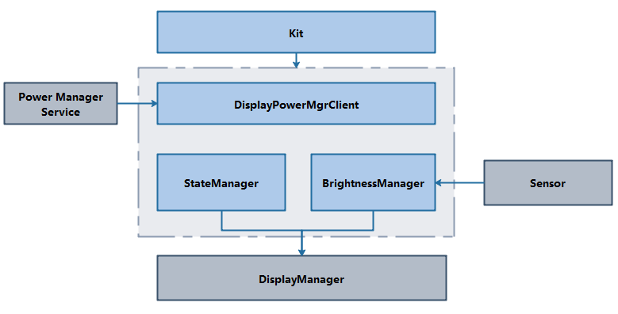

# 显示能效管理组件<a name="ZH-CN_TOPIC_0000001152026155"></a>

-   [简介](#section11660541593)
-   [目录](#section19472752217)
-   [相关仓](#section63151229062)

## 简介<a name="section11660541593"></a>

显示能效管理组件主要负责显示屏的亮/灭、亮度调节等功能，如下：

1.  显示屏的亮/灭。
2.  显示屏亮度调节。

**图 1**  显示能效管理组件架构图<a name="fig106301571239"></a> 


## 目录<a name="section19472752217"></a>

```
base/powermgr/display_manager$
├── interfaces      # 接口层
│   ├── innerkits   # 内部接口
│   └── kits        # 外部接口
├── sa_profile      # SA配置文件
├── services        # 服务层
│   ├── native      # Native层
│   └── zidl        # zidl层
└── utils           # 工具和通用层
```

## 相关仓<a name="section63151229062"></a>

[电源管理子系统](https://gitee.com/openharmony/docs/blob/master/zh-cn/readme/%E7%94%B5%E6%BA%90%E7%AE%A1%E7%90%86%E5%AD%90%E7%B3%BB%E7%BB%9F.md)

[powermgr_power_manager](https://gitee.com/openharmony/powermgr_power_manager)

**powermgr_display_manager**

[powermgr_battery_manager](https://gitee.com/openharmony/powermgr_battery_manager)

[powermgr_thermal_manager](https://gitee.com/openharmony/powermgr_thermal_manager)

[powermgr_battery_statistics](https://gitee.com/openharmony/powermgr_battery_statistics)

[powermgr_battery_lite](https://gitee.com/openharmony/powermgr_battery_lite)

[powermgr_powermgr_lite](https://gitee.com/openharmony/powermgr_powermgr_lite)
